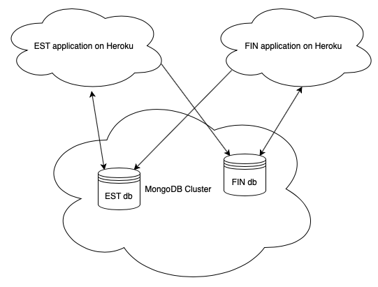

# Example for FINEST ATS Information System configuration

Provided are:

- Backend using node.js, express, mongodb and server side events
- Frontend with basic functionality and user authentication/authorisation

[Link to EST application](https://atsinfo-finest-est.herokuapp.com)

[Link to FIN application](https://atsinfo-finest-fin.herokuapp.com)

Configuration:

Issues to be considered:

- Error message should be displayed if POST request to other site has failed
- How to synchronize the state after a problem?
